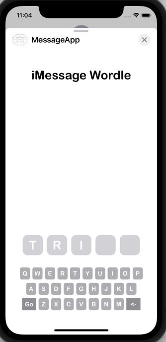
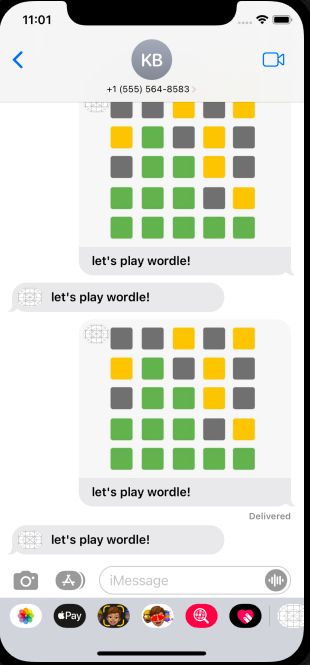
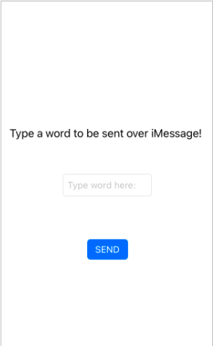
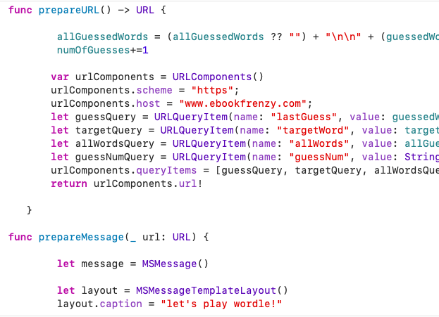
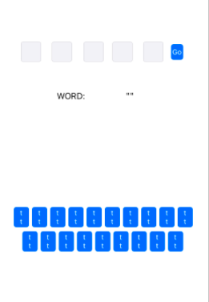
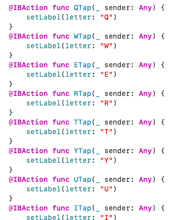
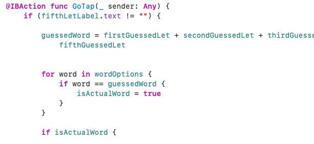
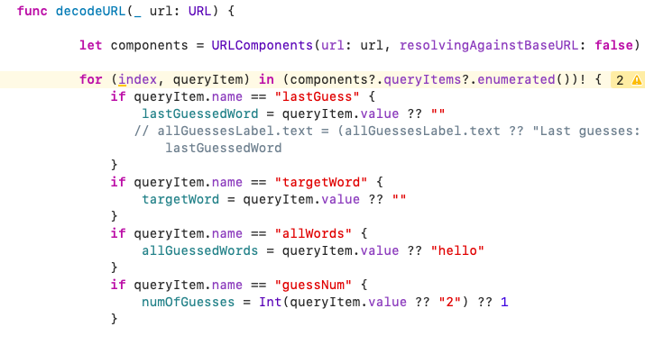
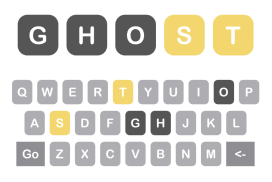
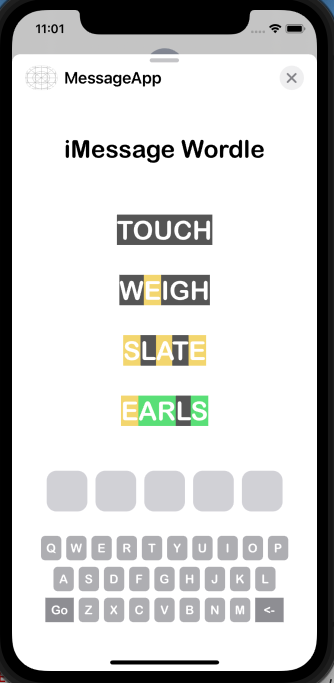

# EPHS Word Game

EPHS Word Game is an app that resembles the popular New York Times word game "Wordle" where players guess a set 5 letter word and get feedback after making there guess, i.e. what letters are in the correct spot or which ones are not in the word at all. To set our app apart from Wordle and others like it, we decided to add in a multiplayer element and design it to be played by 2 people over the iMessage platform. When brainstorming ideas for what project to focus on during the second half of advanced iOS semester one, we decided we wanted to create a game rather than an app. Connecting the game to wordle was an obvious choice considering its popularity, but to make our game different we decided we wanted to add a multiplayer element to the game. 

  

The first thing I worked on when creating our EPHS Word Game was learning the frameworks for coding a program over the iMessage platform. XCode has a built-in guideline for iMessage apps, but it is still relatively new so figuring out its functionality was challenging. Once I learned how the interface for an iMessage game would work, I focused on learning how to send new data from one player to another, which is done my creating then subsequentially decoding a URL with the information that needs to be passed over. 

  

After learning the basic layout for designing an iMessage game, I started creating the user interface for our EPHS Word Game using storyboards. The interface went through a lot of trial and error. Initially, I used textboxes as the placeholders for each letter in the word, and learned how to automatically send the user to the following textbox when one was full. 

However, I soon realized that in order for the game to display the results of the previous guesses made, the user keyboard must be made of objects, so the letters would more easily be displayed in labels rather than textboxes. I recreated the user interface by creating a keyboard where each letter in a button and set up a row of 5 labels to display the guessed word by the user. 

Once the Word Game user interface was ready enough to be used, I turned my focus to coding the actual functionality of the game. Each keyboard button and label had to be tied in from the storyboard to the code and checked to ensure they were functioning correctly. The "GO" button had to be coded to ensure that it would not actually function unless each label held a letter. It also had to check to see if the word guessed by the user is an actual word in the dictionary, which was done by running the word through an array of 5 letter words and seeing if it matched any. 

  

From there, I started on creating the URL which would be used to send information from one user to another, starting by sending the target word and the word that was last guessed by the user. I had problem decoding the URL and learned that the only type of information that can be a part of the URL is String information. 

At this point, I had the user interface and basic code for the Word Game set, so the application would run and pass words over from one player to another. I could then focus on the engaging part of the game, trying to correctly guess the target word. I worked to set the label colors of each letter after the user makes a guess: a correct letter would turn green, a letter in the wrong spot would turn yellow, and an incorrect letter would turn grey. I also worked to set the colors of the keyboard letters to match the ones of the label. The more difficult part was learning a way to send the information about each letter to the next user. Currently, the user recevies the previously guessed words and the color of each letter, but the color of the keyboard keys do not yet udpate. 

  

In the coming weeks, I am looking to have the keyboard letter colors update depending on previous guesses. I also still need to learn how to add the previous guesses into a scrollview so they can all be displayed if the players take multiple guesses to identify the word. Finally, I need to figure out how to end the game, which will happen when one of the user's guesses matches the set target word.
