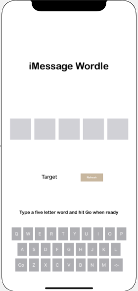
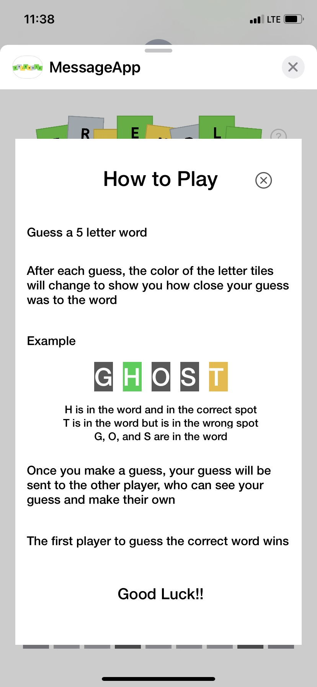
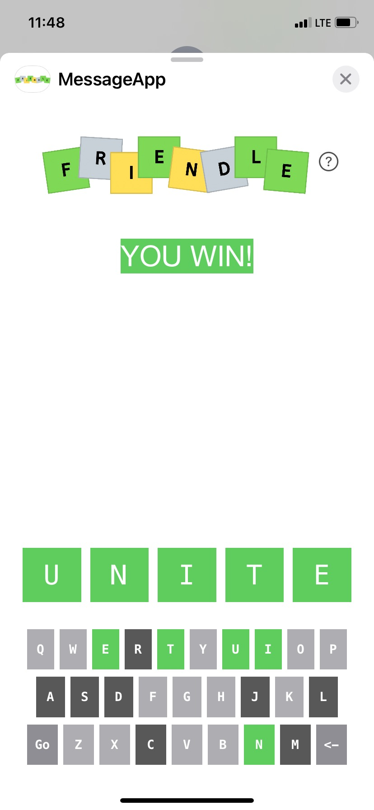
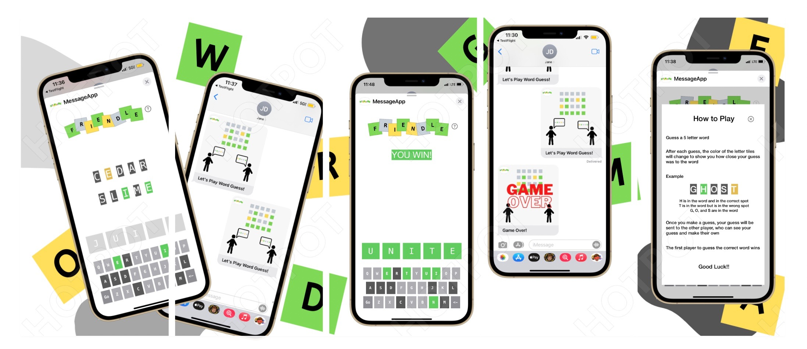

# Friendle 🎮📱  
*A multiplayer iMessage word game inspired by Wordle*

## Overview  
Friendle is a two-player word guessing game designed for iMessage. Inspired by the New York Times’ **Wordle**, Friendle challenges players to guess a hidden five-letter word, but with a twist: the game is played directly in iMessage with real-time multiplayer interaction.  

Unlike traditional Wordle clones, Friendle focuses on **social gameplay**—two players take turns guessing words, sending results back and forth via iMessage.  

---

## Key Features  
- **Multiplayer Gameplay** – Play head-to-head with friends via iMessage.  
- **Interactive Keyboard** – Custom in-game keyboard built with buttons, not text fields.  
- **Word Validation** – Ensures only valid five-letter dictionary words can be submitted.  
- **Feedback System** – Letters turn **green** (correct spot), **yellow** (wrong spot), or **grey** (not in word).  
- **State Sharing** – Game state (words + letter colors) is passed between players via encoded URLs.  

---

## Development Process  

### 1. Learning iMessage Frameworks  
Xcode provides templates for iMessage apps, but the functionality is relatively new and documentation is limited. The first challenge was learning how iMessage apps send and receive data. I used **URL encoding/decoding** to transfer words and game states between players.  

  

---

### 2. Building the User Interface  
- **Initial Design:** Began with textboxes for each letter, using auto-advance between fields.

  

- **Refined Design:** Rebuilt UI with button-based keyboard and labels for guesses—making it easier to display colors and results.  

  

---

### 3. Implementing Game Logic  
- Connected each keyboard button and label from the storyboard to Swift code.  
- Added validation checks:  
  - The **GO** button only works if all 5 letters are entered.  
  - Words must exist in a predefined dictionary of 5-letter words.  

---

### 5. Feedback & Visuals  
- Implemented color updates for both guess labels and keyboard keys.  

  
  

---

## How to Play  
1. Guess a **five-letter word**.  
2. After each guess, tile colors show how close your guess was:  
   - 🟩 Green – letter is correct and in the right spot  
   - 🟨 Yellow – letter is in the word but in the wrong spot  
   - ⬛ Grey – letter is not in the word  
3. Your guess is sent to the other player via iMessage.  
4. Players take turns guessing until one gets the word.  

The first player to guess the correct word **wins**.  

  
  

---

### App Store Preview  

---

## Challenges & Next Steps  
### ✅ Completed:  
- Multiplayer functionality over iMessage  
- Core game loop (guess → validate → send results → next turn)  
- Custom keyboard + color feedback system  

---

## Tech Stack  
- **Platform:** iOS (Xcode, iMessage framework)  
- **Language:** Swift  
- **UI:** Storyboards, Custom keyboard with buttons/labels  
- **Networking:** URL Encoding/Decoding for game state transfer  

---

## Future Improvements  
- 🎨 Polished UI with animations  
- 📜 Game history view with scrollable past guesses  
- 🔄 Restart option for new games    
- 🔗 Potential expansion beyond iMessage  
